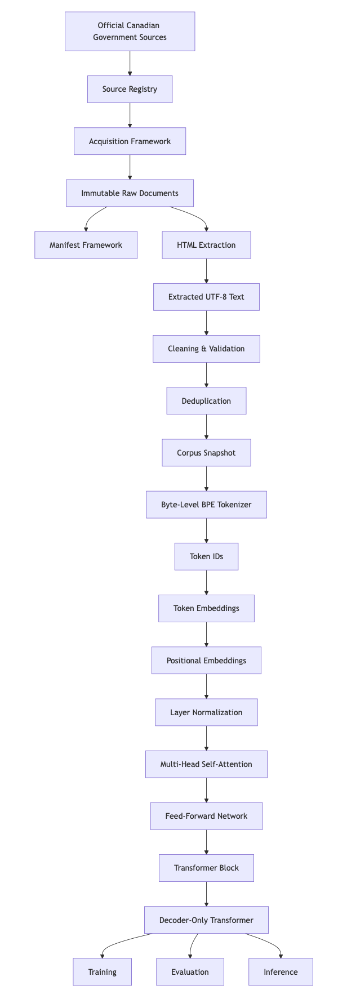

# CanGovLM

<p align="center">


</p>

CanGovLM is a decoder-only Transformer language model built from scratch using official Canadian government data.

The objective of this project is to understand and implement every core component of a modern language model, including tokenization, data processing, model architecture, training, evaluation, and inference—without using pretrained weights or existing large language models.

The project is developed incrementally as an educational, research, and portfolio project. Every major component is designed, implemented, documented, and evaluated step by step.

## Project Goals

- Build a language model completely from scratch.
- Train exclusively on official Canadian government data.
- Support English first, followed by bilingual English/French.
- Maintain a transparent and reproducible training pipeline.
- Demonstrate end-to-end language model engineering.  


## Current Status

Current milestone: **Phase 5 – Transformer Implementation**

Completed:

- ✅ Project foundation
- ✅ Byte-level BPE tokenizer
- ✅ BPE merge learning
- ✅ Token encoding
- ✅ Token decoding
- ✅ Corpus specification
- ✅ Official source registry
- ✅ Document acquisition framework
- ✅ Document manifest framework
- ✅ Document extraction framework
- ✅ HTML extractor
- ✅ Canada.ca acquisition client
- ✅ End-to-end single-document pipeline
- ✅ Immutable corpus snapshot architecture
- ✅ Transformer configuration
- ✅ Token embedding layer
- ✅ Positional embedding layer
- ✅ Layer normalization
- ✅ Multi-head self-attention
- ✅ 180 automated tests

## Roadmap

- ✅ Project setup
- ✅ Tokenizer
- ✅ Corpus pipeline
- ✅ Initial production corpus pipeline
- ⏳ Feed-forward network
- ⏳ Transformer block
- ⏳ Decoder-only Transformer
- ⏳ Model pretraining
- ⏳ Evaluation
- ⏳ Inference
- ⏳ Demo. 

## Transformer Progress

Completed:

- ✅ Transformer configuration
- ✅ Token embedding
- ✅ Positional embedding
- ✅ Layer normalization
- ✅ Multi-head self-attention

Remaining:

- ⏳ Feed-forward network
- ⏳ Transformer block
- ⏳ Decoder-only Transformer
- ⏳ Training
- ⏳ Text generation. 

## Architecture

<p align="center">
  
</p>

The diagram above summarizes the end-to-end CanGovLM pipeline, from official Canadian government data acquisition through corpus preparation, tokenization, Transformer architecture, training, evaluation, and inference.

## Features

- Byte-level BPE tokenizer built entirely from scratch
- UTF-8 byte vocabulary
- Deterministic BPE merge learning
- Token encoding and decoding
- Production-style corpus pipeline
- Official government source registry
- Immutable corpus snapshots
- HTML acquisition and extraction pipeline
- End-to-end acquisition → extraction workflow
- Comprehensive automated test suite (180 tests)
- No pretrained tokenizer libraries
- No pretrained language model weights

## Repository Layout

- `corpus/`: Curated source text organized by language.
- `data/`: Raw, interim, and processed datasets.
- `vocabulary/`: Tokenizer vocabulary and metadata.
- `configs/`: Configuration files.
- `src/cangovlm/`: Core implementation.
- `tests/`: Automated tests.
- `checkpoints/`: Saved model checkpoints.
- `artifacts/`: Logs, reports, and generated outputs.
- `inference/`: Text generation and inference.
- `benchmarks/`: Evaluation results.
- `demo/`: Demonstration applications.
- `docs/`: Design documents, roadmap, and experiment notes.

## Repository Structure

```text
.
├── .github
│   └── workflows
│       └── ci.yml
├── .gitignore
├── LICENSE
├── Makefile
├── README.md
├── artifacts
│   └── README.md
├── benchmarks
│   └── README.md
├── checkpoints
│   └── README.md
├── configs
│   ├── data
│   │   ├── .gitkeep
│   │   └── source_registry.json
│   ├── model
│   │   └── .gitkeep
│   ├── tokenizer
│   │   └── .gitkeep
│   └── training
│       └── .gitkeep
├── corpus
│   ├── README.md
│   ├── en
│   │   └── README.md
│   └── fr
│       └── README.md
├── data
│   ├── README.md
│   ├── interim
│   │   └── .gitkeep
│   ├── processed
│   │   └── .gitkeep
│   └── raw
│       └── .gitkeep
├── demo
│   └── README.md
├── docs
│   ├── corpus_specification.md
│   ├── data_sources.md
│   ├── design_notes.md
│   ├── experiments.md
│   └── roadmap.md
├── inference
│   └── README.md
├── notebooks
│   └── README.md
├── pyproject.toml
├── requirements-dev.txt
├── scripts
│   └── README.md
├── src
│   └── cangovlm
│       ├── __init__.py
│       ├── data
│       │   ├── __init__.py
│       │   ├── acquisition.py
│       │   ├── extraction.py
│       │   ├── manifests.py
│       │   ├── single_document_pipeline.py
│       │   └── source_registry.py
│       ├── evaluation
│       │   └── __init__.py
│       ├── model
│       │   └── __init__.py
│       ├── tokenizer
│       │   ├── __init__.py
│       │   ├── bpe.py
│       │   ├── bytes.py
│       │   ├── corpus.py
│       │   ├── decoding.py
│       │   ├── encoding.py
│       │   └── vocabulary.py
│       ├── training
│       │   └── __init__.py
│       └── utils
│           └── __init__.py
├── tests
│   ├── __init__.py
│   ├── data
│   │   ├── .gitkeep
│   │   ├── __init__.py
│   │   ├── test_acquisition.py
│   │   ├── test_canada_ca_acquisition.py
│   │   ├── test_extraction.py
│   │   ├── test_html_extractor.py
│   │   ├── test_manifests.py
│   │   ├── test_single_document_pipeline.py
│   │   └── test_source_registry.py
│   ├── evaluation
│   │   └── .gitkeep
│   ├── fixtures
│   │   └── html
│   │       ├── chrome_only.html
│   │       ├── french_page.html
│   │       └── official_page.html
│   ├── model
│   │   └── .gitkeep
│   ├── tokenizer
│   │   ├── .gitkeep
│   │   ├── __init__.py
│   │   ├── test_bpe.py
│   │   ├── test_bytes.py
│   │   ├── test_corpus.py
│   │   ├── test_decoding.py
│   │   ├── test_encoding.py
│   │   └── test_vocabulary.py
│   └── training
│       └── .gitkeep
└── vocabulary
    └── README.md

```    

## Latest Release

**v0.3.0 – Corpus Pipeline Foundation**

Highlights:

- Complete byte-level BPE tokenizer
- Production-ready corpus architecture
- Source registry
- Acquisition framework
- Manifest framework
- HTML extraction
- End-to-end single-document pipeline


## Author

**Alem Mekru**

AI Engineer | MSc Artificial Intelligence

- GitHub: https://github.com/AlemMekru
- LinkedIn: https://www.linkedin.com/in/alemmekru/
